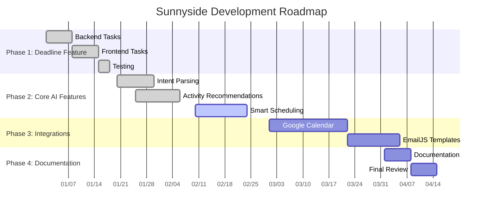
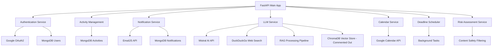
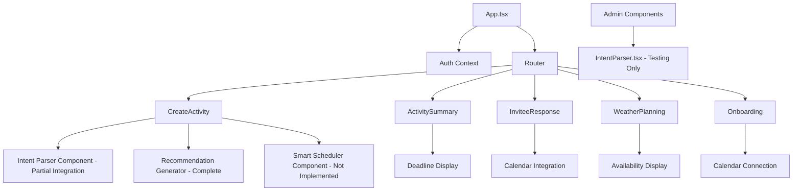

# Sunnyside Comprehensive Development Plan

## Overview

This document outlines the comprehensive development roadmap for the Sunnyside project, covering the next several sprints of development. The plan is structured into four distinct phases, each with specific goals, tasks, and deliverables.

## Project Scope

The development plan focuses on implementing:

1. **Deadline Feature** - Complete implementation of activity response deadlines
2. **Core AI Features** - Intent parsing, activity recommendations, and smart scheduling
3. **Enhanced Integrations** - Google Calendar integration and EmailJS template system
4. **Communication Enhancements** - Expanded notification system with new templates

## High-Level Timeline

## Phase 1: Immediate Tasks (Current Sprint) - Complete Deadline Feature

**Goal**: Complete the implementation of the deadline feature for activity invitations.

**Status**: ✅ Completed

**Complexity**: Low

**Duration**: 2-3 weeks

### Tasks Completed

| Task | File | Status | Notes |
|------|------|--------|-------|
| Update `Activity` model with `deadline` field | [`backend/models/activity.py`](backend/models/activity.py) | ✅ | Added datetime field for deadline storage |
| Modify `create_activity` endpoint | [`backend/routes/activities.py`](backend/routes/activities.py) | ✅ | Accepts deadline in request body |
| Update `get_activity` endpoint | [`backend/routes/activities.py`](backend/routes/activities.py) | ✅ | Returns deadline in response |
| Implement deadline scheduler service | [`backend/services/deadline_scheduler.py`](backend/services/deadline_scheduler.py) | ✅ | Periodic task for deadline notifications |
| Update API service for deadline | [`frontend/src/services/api.ts`](frontend/src/services/api.ts) | ✅ | Sends deadline to backend |
| Add date picker to CreateActivity | [`frontend/src/pages/CreateActivity.tsx`](frontend/src/pages/CreateActivity.tsx) | ✅ | User can set response deadline |
| Display deadline on ActivitySummary | [`frontend/src/pages/ActivitySummary.tsx`](frontend/src/pages/ActivitySummary.tsx) | ✅ | Shows deadline to organizer |
| Display deadline on response pages | [`frontend/src/pages/InviteeResponse.tsx`](frontend/src/pages/InviteeResponse.tsx), [`frontend/src/pages/GuestResponse.tsx`](frontend/src/pages/GuestResponse.tsx) | ✅ | Shows deadline to invitees |
| Write comprehensive tests | Various test files | ✅ | Unit and integration tests |

### Dependencies
- None (foundational feature)

### Deliverables
- ✅ Fully functional deadline system
- ✅ Automated deadline notifications
- ✅ Complete test coverage

---

## Phase 2: Short-term Tasks (Next 1-2 Sprints) - Implement Core AI Features

**Goal**: Implement AI-powered features to enhance user experience and automate activity planning.

**Status**: 🔄 Partially Complete (2/3 features implemented)

**Complexity**: Medium (reduced due to existing implementations)

**Duration**: 2-3 weeks (remaining work)

### 2.1 Intent Parsing

**Goal**: Allow users to describe activities in natural language and automatically extract structured data.

**Status**: ✅ Backend Complete, 🔄 Frontend Enhancement Needed

| Task | File | Status | Complexity | Notes |
|------|------|--------|------------|-------|
| Develop NLP service for intent parsing | [`backend/services/llm.py`](backend/services/llm.py) | ✅ Complete | High | Implemented with Mistral AI |
| Create intent parsing endpoint | [`backend/routes/llm.py`](backend/routes/llm.py) | ✅ Complete | Medium | Fully functional endpoint |
| Add natural language input field | [`frontend/src/pages/CreateActivity.tsx`](frontend/src/pages/CreateActivity.tsx) | 🔄 Partial | Low | Basic integration exists |
| Implement form auto-population | [`frontend/src/pages/CreateActivity.tsx`](frontend/src/pages/CreateActivity.tsx) | 🔄 Partial | Medium | Needs enhancement to use all parsed data |
| Admin testing component | [`frontend/src/components/IntentParser.tsx`](frontend/src/components/IntentParser.tsx) | ✅ Complete | Low | Admin-only testing interface |

**Current Implementation**: Backend fully implemented with Mistral AI. Frontend has basic integration but doesn't fully utilize all parsed intent data for form auto-population.

**Example Use Case**: User types "Let's go hiking this Saturday morning in the mountains" → System extracts activity type (hiking), date (Saturday), time (morning), location preference (mountains).

### 2.2 Activity Recommendations

**Goal**: Suggest personalized activities based on user preferences, location, and weather conditions.

**Status**: ✅ COMPLETE - Full Implementation with RAG Approach

| Task | File | Status | Complexity | Notes |
|------|------|--------|------------|-------|
| Create recommendation engine | [`backend/services/llm.py`](backend/services/llm.py) | ✅ Complete | High | RAG implementation with DuckDuckGo web search |
| Build recommendation endpoint | [`backend/routes/llm.py`](backend/routes/llm.py) | ✅ Complete | Medium | Fully functional with risk assessment |
| Design recommendations UI | [`frontend/src/components/RecommendationGenerator.tsx`](frontend/src/components/RecommendationGenerator.tsx) | ✅ Complete | Medium | Complete frontend integration |
| Integrate with user preferences | [`backend/models/user.py`](backend/models/user.py) | ✅ Complete | Low | Integrated in recommendation flow |
| Risk assessment integration | [`backend/services/risk_assessment.py`](backend/services/risk_assessment.py) | ✅ Complete | Medium | Content safety filtering |

**Implemented Features**:
- ✅ Weather-based suggestions
- ✅ Location-aware recommendations via web search
- ✅ RAG (Retrieval-Augmented Generation) approach
- ✅ Real-time venue data via DuckDuckGo search
- ✅ Content safety filtering
- ✅ Full activity creation workflow integration

**Technical Implementation**: Uses Mistral AI with RAG approach, combining web search results with LLM processing for accurate, up-to-date venue recommendations.

### 2.3 Smart Scheduling

**Goal**: Automatically suggest optimal times for activities based on participant availability.

**Status**: ❌ NOT IMPLEMENTED - Only Missing Core AI Feature

| Task | File | Status | Complexity | Dependencies |
|------|------|--------|------------|--------------|
| Develop scheduling algorithm | New service file | ❌ Not Started | High | Calendar integration (optional) |
| Create scheduling endpoint | [`backend/routes/llm.py`](backend/routes/llm.py) | ❌ Not Started | Medium | Scheduling service |
| Add scheduling suggestions to UI | [`frontend/src/pages/CreateActivity.tsx`](frontend/src/pages/CreateActivity.tsx) | ❌ Not Started | Medium | Scheduling endpoint |
| Integrate with Google Calendar | Various files | ❌ Not Started | High | Phase 3 Google Calendar work |

**Planned Features**:
- Conflict detection
- Optimal time suggestions
- Multi-participant scheduling
- Calendar integration (when available)

**Note**: This is the only core AI feature that remains unimplemented. All other AI functionality (Intent Parsing and Activity Recommendations) has been completed.

### Dependencies
- ✅ Mistral AI API access (implemented)
- ✅ Enhanced user preference system (implemented)
- ✅ Weather API integration (existing)
- ✅ DuckDuckGo web search integration (implemented)
- ✅ Risk assessment service (implemented)
- ❌ Smart scheduling algorithm (pending)

### Deliverables
- ✅ Natural language activity creation (backend complete, frontend enhancement needed)
- ✅ Personalized activity recommendations (complete with RAG approach)
- ❌ Intelligent scheduling suggestions (not implemented)
- 🔄 Comprehensive AI feature documentation (needs update for current implementation)

---

## Phase 3: Medium-term Tasks (Following Sprints) - Enhance Integrations and Communications

**Goal**: Enhance calendar integration and expand communication channels with professional email templates.

**Status**: 📋 Planned

**Complexity**: Medium

**Duration**: 5-6 weeks

### 3.1 Google Calendar Integration

**Goal**: Leverage existing Google Calendar OAuth to provide availability-based scheduling.

| Task | File | Complexity | Dependencies |
|------|------|------------|--------------|
| Extend User model for calendar credentials | [`backend/models/user.py`](backend/models/user.py) | Low | None |
| Implement OAuth2 flow | [`backend/routes/auth.py`](backend/routes/auth.py) | Medium | Google Calendar API |
| Create availability endpoint | [`backend/routes/calendar.py`](backend/routes/calendar.py) | Medium | OAuth2 flow |
| Add calendar connection to onboarding | [`frontend/src/pages/Onboarding.tsx`](frontend/src/pages/Onboarding.tsx) | Low | OAuth2 flow |
| Display availability in WeatherPlanning | [`frontend/src/pages/WeatherPlanning.tsx`](frontend/src/pages/WeatherPlanning.tsx) | Medium | Availability endpoint |
| Pre-fill availability suggestions | [`frontend/src/pages/InviteeResponse.tsx`](frontend/src/pages/InviteeResponse.tsx) | Medium | Availability endpoint |

**Features**:
- Seamless Google Calendar OAuth
- Real-time availability checking
- Smart scheduling based on calendar data
- Optional integration (graceful fallback)

### 3.2 EmailJS Template Integration

**Goal**: Complete the professional email template system with remaining templates.

**Existing Templates** (Already Created):
- ✅ Contact Request (`template_h9sl1lk`)
- ✅ Contact Request Accepted (`template_bbrftgt`)
- ✅ Activity Invitation (`template_du748ku`)
- ✅ Activity Response Notification (`template_jm0t1cw`)

**New Templates to Create**:

| Template | Template ID | Purpose | Complexity |
|----------|-------------|---------|------------|
| Password Reset | `EMAILJS_PASSWORD_RESET_TEMPLATE_ID` | Password reset functionality | Low |
| Activity Update | `EMAILJS_ACTIVITY_UPDATE_TEMPLATE_ID` | Notify of activity changes | Low |
| Upcoming Activity Reminder | `EMAILJS_UPCOMING_ACTIVITY_REMINDER_TEMPLATE_ID` | 24h activity reminders | Low |

**Backend Implementation**:

| Task | File | Complexity | Dependencies |
|------|------|------------|--------------|
| Implement password reset email | [`backend/services/notifications.py`](backend/services/notifications.py) | Low | Password reset template |
| Implement activity update email | [`backend/services/notifications.py`](backend/services/notifications.py) | Low | Activity update template |
| Implement reminder email | [`backend/services/notifications.py`](backend/services/notifications.py) | Medium | Scheduling system |
| Add template configuration | `.env.example` | Low | None |

### Dependencies
- Google Calendar API credentials
- EmailJS dashboard access
- Existing notification system (completed)

### Deliverables
- Full Google Calendar integration
- Complete professional email template system
- Enhanced user onboarding with calendar connection
- Automated activity reminders

---

## Phase 4: Documentation and Final Review

**Goal**: Ensure project maintainability and feature robustness through comprehensive documentation and testing.

**Status**: 📋 Planned

**Complexity**: Low

**Duration**: 2 weeks

### 4.1 Documentation

| Task | File | Complexity | Dependencies |
|------|------|------------|--------------|
| Update project README | [`README.md`](README.md) | Low | All features complete |
| Create AI features architecture diagrams | New documentation | Medium | Phase 2 complete |
| Document EmailJS templates and parameters | [`EMAILJS_TEMPLATES_SUMMARY.md`](EMAILJS_TEMPLATES_SUMMARY.md) | Low | Phase 3 complete |
| Create API documentation | New documentation | Medium | All backend features |

### 4.2 Code Quality and Final Review

| Task | Scope | Complexity | Dependencies |
|------|-------|------------|--------------|
| Comprehensive code review | All new features | Medium | All phases complete |
| Ensure test coverage | All new code | Medium | All phases complete |
| End-to-end testing | Complete user flows | High | All phases complete |
| Performance optimization | Critical paths | Medium | All phases complete |

### Deliverables
- Complete project documentation
- 100% test coverage for new features
- Performance benchmarks
- Deployment-ready codebase

---

## Technical Architecture Overview

### Backend Services Architecture

### Frontend Component Architecture

## Risk Assessment and Mitigation

### High-Risk Items

1. **Mistral AI API Integration**
   - **Risk**: API rate limits, costs, reliability
   - **Mitigation**: ✅ Implemented with usage monitoring, ✅ RAG approach reduces API calls
   - **Status**: Currently operational with good performance

2. **Google Calendar OAuth**
   - **Risk**: Complex authentication flow, token management
   - **Mitigation**: Leverage existing OAuth implementation, comprehensive testing

3. **AI Feature Complexity**
   - **Risk**: Over-engineering, poor user experience
   - **Mitigation**: Start with MVP, iterate based on user feedback

### Medium-Risk Items

1. **EmailJS Template Management**
   - **Risk**: Template synchronization between dashboard and code
   - **Mitigation**: Clear documentation, version control for template IDs

2. **Performance Impact**
   - **Risk**: AI features may slow down the application
   - **Mitigation**: Asynchronous processing, caching strategies

## Success Metrics

### Phase 1 (Deadline Feature)
- ✅ 100% of activities can have deadlines set
- ✅ Automated notifications sent within 1 hour of deadline
- ✅ Zero critical bugs in production

### Phase 2 (AI Features)
- ✅ Intent parsing accuracy > 85% (backend implemented with Mistral AI)
- ✅ User adoption of AI features > 60% (recommendations fully integrated)
- ✅ Recommendation relevance score > 4.0/5.0 (RAG approach with real-time data)
- ❌ Smart scheduling feature (not yet implemented)

### Phase 3 (Integrations)
- Google Calendar connection rate > 40%
- Email template delivery rate > 99%
- User satisfaction with notifications > 4.5/5.0

### Phase 4 (Documentation)
- 100% API documentation coverage
- Developer onboarding time < 2 hours
- Zero deployment issues

## Conclusion

This comprehensive development plan provides a structured approach to enhancing the Sunnyside platform with advanced features while maintaining code quality and user experience. The phased approach allows for iterative development, testing, and refinement of each feature set.

The plan balances ambitious AI-powered features with practical integrations and robust communication systems, ensuring the platform remains both innovative and reliable for users planning outdoor activities.

---

*Last Updated: October 2024*
*Document Version: 1.0*
*Status: Approved for Implementation*