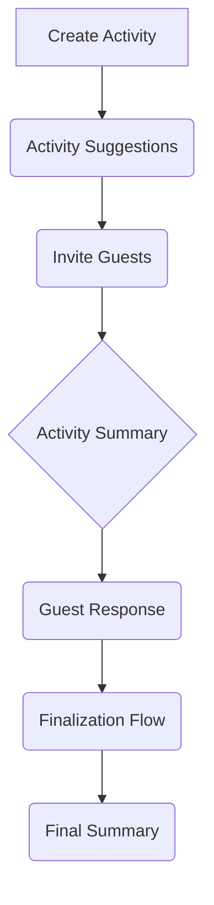

# Finalization Flow Architectural Plan

This document outlines the architectural plan for implementing the Finalization Flow in the Sunnyside application.

## 1. Reusable Components

### UI Components (`frontend/src/components/ui`)

*   **Button:** Standard button component, will be used for all actions.
*   **Card:** Main container for different sections of the UI.
*   **Badge:** To display status labels and other metadata.
*   **Dialog/Alert Dialog:** For confirmations and modals.
*   **Input:** For text inputs.
*   **Checkbox:** For selecting options.
*   **RadioGroup:** For single-choice selections.
*   **Calendar:** For date picking.
*   **Textarea:** For multiline text inputs.

### Custom Components (`frontend/src/components`)

*   **RecommendationGenerator:** Can be adapted for AI-powered date/venue suggestions.
*   **SmartScheduling:** May contain logic for date/time selection that can be reused.

## 2. Data Flow

## 3. Architectural Plan

### New Components

*   **FinalizationPage.tsx:** A new page to host the finalization flow. This will be the main container for the new workflow.

### Enhanced Components (Reused & Adapted)

*   **DateVenueSuggester.tsx:** This will adapt the existing `RecommendationGenerator` component. The core change will be to modify the AI prompt to include the group's availability and preferences, providing more tailored suggestions.
*   **FinalInviteeManager.tsx:** This will reuse the invitee management logic from `InviteGuests.tsx` but will be adapted for the final confirmation step, focusing on confirming the final list of attendees rather than sending initial invites.
*   **FinalSummary.tsx:** This will be an enhanced version of the `ActivitySummary.tsx` page, displaying the finalized date, time, and venue, along with the confirmed guest list.

### Modified Components

*   **ActivitySummary.tsx:** Add a "Finalize" button to trigger the finalization flow for activities that have collected responses.

### Backend API Endpoints

*   **POST /activities/{activity_id}/finalize:** A new endpoint to finalize an activity.
*   **GET /activities/{activity_id}/suggestions:** A new endpoint to get AI-powered date/venue suggestions.

### Database Schema Changes

*   **Activity Model:** Add a `finalized_date` and `finalized_venue` field.