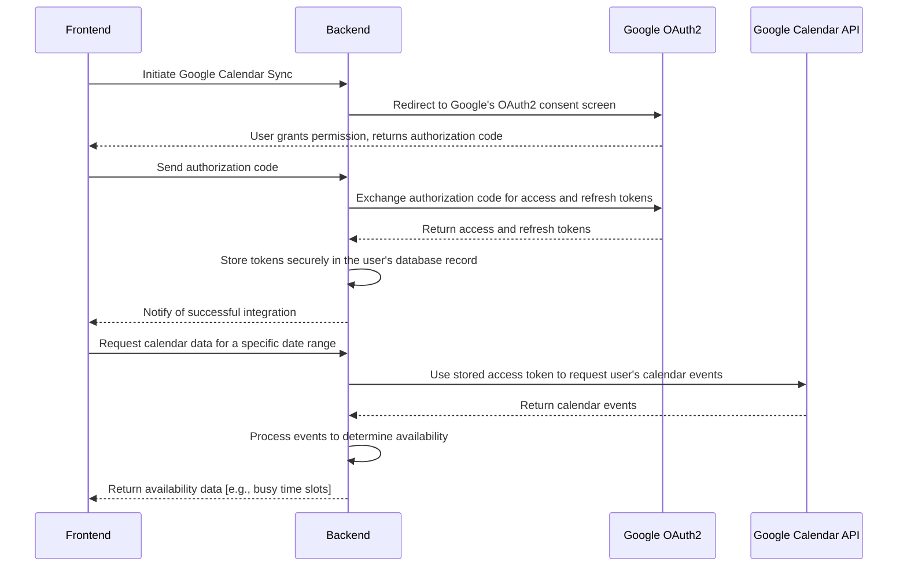

# Google Calendar Integration Architectural Plan

## 1. Google Calendar API Integration Architecture

The integration will follow a standard client-server architecture. The frontend will initiate the authentication process, and the backend will handle the communication with the Google Calendar API.



## 2. Authentication Flow for Google Calendar (OAuth2)

We will use the OAuth2 protocol for authentication.

1.  **Initiation:** The user clicks a "Connect Google Calendar" button in the frontend.
2.  **Redirect to Google:** The frontend calls a backend endpoint (e.g., `/auth/google/calendar`), which redirects the user to Google's OAuth2 consent screen.
3.  **User Consent:** The user grants permission to our application to access their calendar data.
4.  **Authorization Code:** Google redirects the user back to our application with an authorization code.
5.  **Token Exchange:** The frontend sends the authorization code to a backend callback endpoint (e.g., `/auth/google/calendar/callback`). The backend exchanges the code for an access token and a refresh token.
6.  **Store Tokens:** The backend securely stores the access and refresh tokens in the `User` model.

## 3. Backend Models and Endpoints

### 3.1. `User` Model Extension (`backend/models/user.py`)

I will add the following fields to the `User` model:

```python
from pydantic import BaseModel, EmailStr, Field, ConfigDict
from typing import List, Optional, Annotated
from bson import ObjectId
from datetime import datetime


# Custom ObjectId type for Pydantic v2
PyObjectId = Annotated[str, Field(description="MongoDB ObjectId as string")]


class User(BaseModel):
    model_config = ConfigDict(
        populate_by_name=True,
        arbitrary_types_allowed=True,
        json_encoders={ObjectId: str}
    )
    
    id: Optional[PyObjectId] = Field(default=None, alias="_id")
    name: str = Field(..., min_length=1, max_length=100)
    email: EmailStr = Field(...)
    hashed_password: str = Field(...)
    location: Optional[str] = Field(None, max_length=100)
    preferences: Optional[List[str]] = Field(default_factory=list)
    role: str = Field(default="user", description="User role (user, admin, etc.)")
    created_at: Optional[datetime] = Field(default_factory=datetime.utcnow)
    google_calendar_integrated: bool = Field(default=False)
    google_calendar_credentials: Optional[dict] = Field(default=None) # To store access_token, refresh_token, etc.
```

### 3.2. New Endpoints

*   **`GET /auth/google/calendar`:** Initiates the OAuth2 flow by redirecting the user to Google's consent screen.
*   **`GET /auth/google/calendar/callback`:** Handles the callback from Google, exchanges the authorization code for tokens, and stores them.
*   **`GET /calendar/availability`:** Fetches the user's availability from their Google Calendar for a given date range. This endpoint will be protected and will use the stored credentials to access the Google Calendar API.

## 4. Frontend Components for Calendar Integration

### 4.1. Onboarding (`frontend/src/pages/Onboarding.tsx`)

I will add a new step to the onboarding flow:

*   **Step 5: Integrations:** This step will offer the option to connect to Google Calendar. It will include a "Connect Google Calendar" button that initiates the OAuth2 flow.

### 4.2. Weather Planning (`frontend/src/pages/WeatherPlanning.tsx`)

*   If the organizer has integrated their calendar, the calendar view will be enhanced to show their availability.
*   I will fetch the user's availability from the `/calendar/availability` endpoint and overlay it on the calendar.
*   The UI will visually distinguish between available and busy time slots.

### 4.3. Invitee Response (`frontend/src/pages/InviteeResponse.tsx`)

*   For registered users with calendar integration, I will fetch their availability and pre-fill the availability note with suggestions.
*   If the user has not integrated their calendar, the existing date picker with a time picker will be shown.

## 5. How Calendar Data Will Be Fetched and Displayed

1.  **Fetching:** When a user visits the Weather Planning or Invitee Response page, the frontend will call the `/calendar/availability` endpoint with the relevant date range.
2.  **Backend Processing:** The backend will use the stored access token to fetch the user's calendar events from the Google Calendar API. It will then process the events to determine the user's busy time slots.
3.  **Displaying:** The frontend will receive the availability data and display it on the calendar. Busy slots will be marked, and the UI will suggest the best dates and times for the activity.

## 6. Integration Points with Existing Flows

*   **Onboarding:** A new, optional step will be added to the onboarding flow.
*   **Weather Planning:** The calendar component will be modified to display availability data.
*   **Invitee Response:** The availability note will be pre-filled with suggestions based on the user's calendar.

## 7. Data Storage for Calendar Integration Preferences

The `User` model will be extended to store the following:

*   `google_calendar_integrated`: A boolean flag to indicate if the user has enabled the integration.
*   `google_calendar_credentials`: A dictionary to store the OAuth2 tokens.

## 8. Fallback Behavior

*   If a user has not integrated their Google Calendar, the application will function as it currently does.
*   The calendar integration will be an optional feature, and the application will not require it to function.
*   If the Google Calendar API is unavailable, the application will gracefully handle the error and fall back to the default behavior.