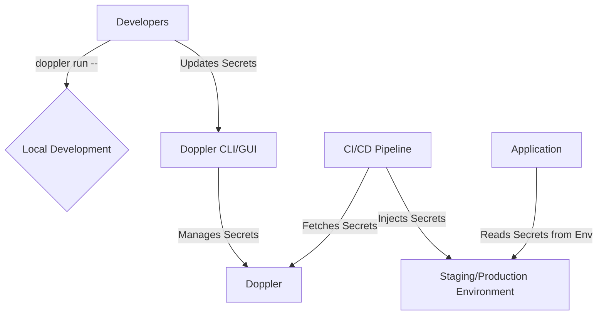

# Secrets Management Architectural Plan

## 1. Current Secrets Management Workflow

The current secrets management approach relies on a `.env` file located in the project's root directory. This file stores all environment-specific configurations, including sensitive credentials, for local development.

### Secrets in Use:

- **Database Credentials:** `MONGODB_URI`
- **Authentication:** `JWT_SECRET_KEY`
- **Third-Party API Keys:** `MISTRAL_API_KEY`, `GOOGLE_CLIENT_ID`, `GOOGLE_CLIENT_SECRET`

### Workflow:

1. **Local Development:** Developers clone the repository and create a `.env` file by copying a template or an existing file. They manually populate the required values for their local environment.
2. **Deployment:** The deployment process is not explicitly defined, but it is assumed that environment variables are manually configured in the production environment.
3. **Onboarding:** New team members must be manually onboarded, which includes sharing the required secrets to create their `.env` file.

### Pain Points:

- **Lack of Version Control:** The `.env` file is listed in `.gitignore`, meaning there is no version control for tracking changes to environment configurations.
- **Manual Synchronization:** Any changes to the environment variables must be manually communicated and synchronized across the team.
- **Security Risks:** Storing secrets in plaintext files poses a security risk, as they can be accidentally committed to version control or exposed.
- **Scalability Issues:** As the number of secrets and environments grows, managing them manually becomes increasingly complex and error-prone.

## 2. Requirements for a New Secrets Management Solution

To address the limitations of the current `.env` file-based approach, a new secrets management solution should meet the following requirements:

- **Centralized Storage:** Provide a single, centralized location for storing and managing all secrets.
- **Encryption at Rest and in Transit:** Ensure that all secrets are encrypted both when stored and when being transmitted.
- **Fine-Grained Access Control:** Allow for granular control over which users and services can access specific secrets.
- **Auditing and Logging:** Track all access and modifications to secrets to ensure accountability and traceability.
- **Environment Support:** Support multiple environments (e.g., development, staging, production) with distinct sets of secrets.
- **Scalability:** Scale to accommodate a growing number of secrets, services, and team members.
- **Developer-Friendly Workflow:** Offer a seamless and intuitive workflow for developers to access secrets during local development.
- **Integration with CI/CD:** Integrate with CI/CD pipelines to automate the injection of secrets during the build and deployment processes.
- **Secret Rotation:** Facilitate the rotation of secrets to minimize the risk of exposure.
- **High Availability and Reliability:** Ensure that the secrets management solution is highly available and reliable to avoid service disruptions.

## 3. Evaluation of Secrets Management Tools

Based on the defined requirements, the following three tools have been evaluated as potential solutions:

| Feature | HashiCorp Vault | AWS Secrets Manager | Doppler |
|---|---|---|---|
| **Centralized Storage** | Yes | Yes | Yes |
| **Encryption** | Yes (AES-256) | Yes (AWS KMS) | Yes (AES-256-GCM) |
| **Access Control** | Yes (Policies) | Yes (IAM Policies) | Yes (Environments & Roles) |
| **Auditing** | Yes (Audit Devices) | Yes (CloudTrail) | Yes (Activity Logs) |
| **Environment Support** | Yes | Yes | Yes |
| **Scalability** | High | High | High |
| **Developer Workflow** | Good (CLI, API) | Good (SDK, CLI) | Excellent (CLI, GUI) |
| **CI/CD Integration** | Yes | Yes | Yes |
| **Secret Rotation** | Yes (Automatic) | Yes (Automatic) | Yes (Manual via API/CLI) |
| **Hosting** | Self-hosted, Cloud | AWS Managed | Cloud |
| **Pricing** | Open-source, Enterprise | Pay-per-secret/API call | Free tier, Paid plans |

### Summary:

- **HashiCorp Vault:** A powerful and flexible solution that can be self-hosted or used as a managed service. It offers a wide range of features but may require more operational overhead.
- **AWS Secrets Manager:** A fully managed service that is tightly integrated with the AWS ecosystem. It is a good choice for applications already running on AWS.
- **Doppler:** A developer-focused solution that prioritizes ease of use and a smooth workflow. It offers a generous free tier and is a good option for teams looking for a simple yet powerful solution.

## 4. Proposed Secrets Management Architecture with Doppler

Based on the evaluation, **Doppler** is the recommended solution due to its developer-friendly workflow, robust security features, and generous free tier.

### Architecture Overview:

### Key Components:

- **Doppler Project:** A dedicated project will be created in Doppler to store all secrets for the Sunnyside application.
- **Environments:** The project will have three environments: `development`, `staging`, and `production`.
- **Access Control:** Team members will be assigned roles (e.g., Viewer, Editor, Admin) to control their access to secrets in each environment.
- **Local Development:** Developers will use the Doppler CLI to run the application locally. The `doppler run` command will inject the secrets for the `development` environment as environment variables.
- **CI/CD Integration:** The CI/CD pipeline will be configured to fetch secrets from Doppler and inject them into the application during the build and deployment process.
- **Secret Backups:** Doppler provides automatic backups of secrets, and manual backups can also be performed.

## 5. Migration Plan

The migration from the `.env` file to Doppler will be performed in the following phases:

### Phase 1: Setup and Initial Configuration

1. **Create a Doppler Account:** Create a new account on Doppler.
2. **Create a Project:** Create a new project named `sunnyside`.
3. **Configure Environments:** Create three environments: `development`, `staging`, and `production`.
4. **Import Secrets:** Import the secrets from the existing `.env` file into the `development` environment in Doppler.
5. **Invite Team Members:** Invite all team members to the Doppler project and assign them the appropriate roles.

### Phase 2: Local Development Integration

1. **Install Doppler CLI:** All developers will install the Doppler CLI on their local machines.
2. **Update Development Workflow:** Developers will update their local development workflow to use the `doppler run` command to start the application.
3. **Remove `.env` File:** The `.env` file will be removed from the project and added to the `.gitignore` file to prevent accidental commits.

### Phase 3: CI/CD Integration

1. **Configure CI/CD Pipeline:** The CI/CD pipeline will be configured to use the Doppler API or CLI to fetch secrets for the `staging` and `production` environments.
2. **Update Deployment Scripts:** The deployment scripts will be updated to inject the secrets as environment variables into the application during the deployment process.

### Phase 4: Production Deployment

1. **Deploy to Staging:** The new secrets management workflow will be deployed to the staging environment for testing.
2. **Deploy to Production:** After successful testing in the staging environment, the new workflow will be deployed to the production environment.

## 6. Best Practices for Secrets Management

To ensure the ongoing security and integrity of the secrets, the following best practices should be adopted:

### Secret Rotation

- **Regular Rotation:** All secrets should be rotated on a regular basis. The rotation frequency should be based on the sensitivity of the secret.
- **Automated Rotation:** Whenever possible, the secret rotation process should be automated to reduce the risk of human error.
- **Revoke Old Secrets:** When a secret is rotated, the old secret should be immediately revoked to prevent its use.

### Access Control

- **Principle of Least Privilege:** Team members should only be granted access to the secrets that are absolutely necessary for their role.
- **Role-Based Access Control (RBAC):** Use Doppler's RBAC features to assign roles to team members and control their access to secrets.
- **Regularly Review Access:** Regularly review the access control policies to ensure that they are still appropriate.

### Auditing

- **Monitor Audit Logs:** Regularly monitor the audit logs in Doppler to detect any suspicious activity.
- **Alert on Anomalies:** Configure alerts to be notified of any anomalous activity, such as a user accessing a secret from an unusual location.
- **Retain Audit Logs:** Retain the audit logs for a sufficient period of time to support security investigations.

## 7. Environment Workflows

The following workflows will be adopted for each environment:

### Development

- **Access:** Developers will have "Editor" access to the `development` environment in Doppler.
- **Workflow:** Developers will use the `doppler run` command to inject secrets into their local development environment.
- **Secret Changes:** Any changes to the secrets in the `development` environment will be immediately available to all developers.

### Staging

- **Access:** The CI/CD pipeline will have "Viewer" access to the `staging` environment. A limited number of team members will have "Editor" access for debugging purposes.
- **Workflow:** The CI/CD pipeline will fetch the secrets from the `staging` environment and inject them into the application during the deployment to the staging environment.
- **Secret Changes:** Any changes to the secrets in the `staging` environment will be deployed to the staging environment on the next CI/CD run.

### Production

- **Access:** The CI/CD pipeline will have "Viewer" access to the `production` environment. Only a small number of authorized team members will have "Admin" access.
- **Workflow:** The CI/CD pipeline will fetch the secrets from the `production` environment and inject them into the application during the deployment to the production environment.
- **Secret Changes:** Any changes to the secrets in the `production` environment will require approval from an "Admin" and will be deployed to the production environment on the next CI/CD run.

## 8. Rollback Plan

In the event of a critical issue during or after the migration, the following rollback plan will be executed:

1. **Revert to `.env` Files:** The application will be reconfigured to use the `.env` files for secrets management.
2. **Update CI/CD Pipeline:** The CI/CD pipeline will be updated to revert to the previous deployment process that does not use Doppler.
3. **Restore `.env` Files:** The `.env` files will be restored from a backup.
4. **Investigate and Resolve Issue:** The root cause of the issue will be investigated and resolved before attempting the migration again.